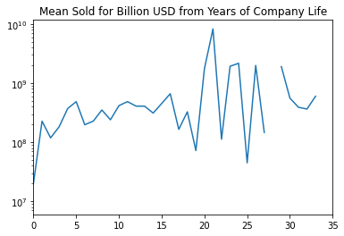
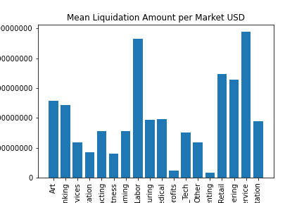
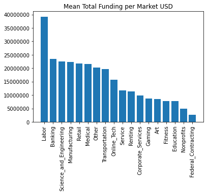
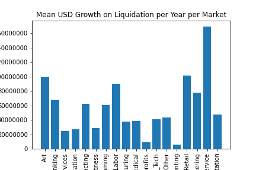
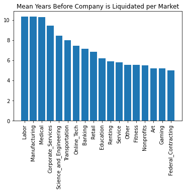
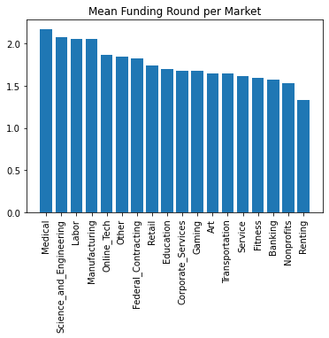

# Startup-Market-Analysis

This graph indicates that 21 years into the company's life is the best time to liquidate for the highest return. There are no relavent outlires that distrupt this conclution. Possible cause for this may be that after 20 years successful CEOs begin to retire from there positions. 

The service industry including restraunts and all that relates to travel. The travel industry has huge companies who overpay for companies who innovate.

Average amount of funding per market. Intrestingly the first labor market company is 23rd in the most funded. This means that companies in Agriculture, Construction, Home & Garden, Home Renovation, Food Processing, Architecture, and Farming are most consistantly funded at high amounts.

Success in start ups comes with completing goals from investors. Funding rounds perfectly illistrate that if one starts a startup in healthcare they are most likely to last the longest with the most success while the rental market has the lowest success rate. 
