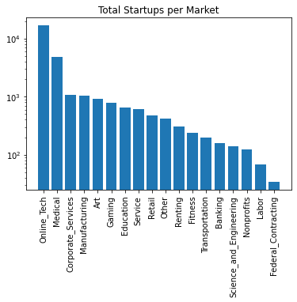
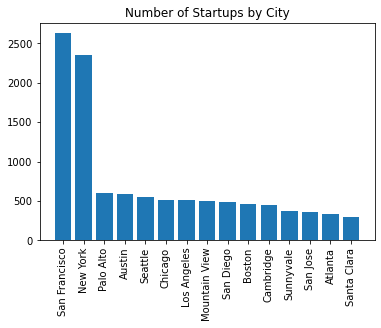
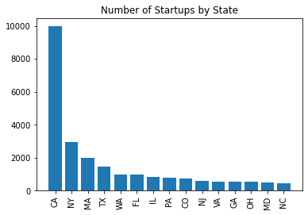
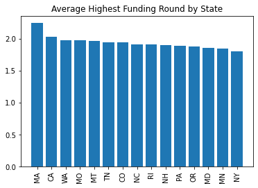
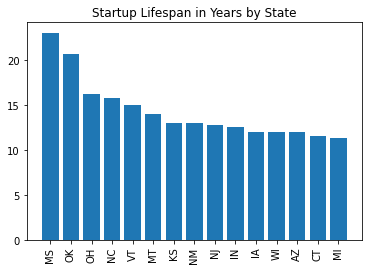
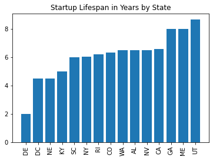
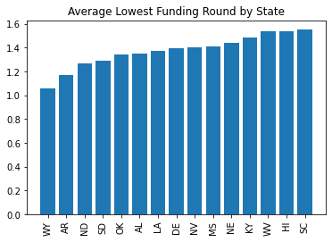
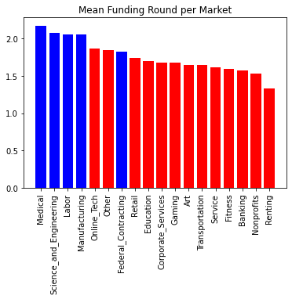

# Startup-Market-Analysis
[Presentation Link](https://docs.google.com/presentation/d/1DKAZ7PrOn75aMGxz-vrxCdEtelQcBRwSux1HWWHaYIw/edit?usp=sharing)
---
This project is for entrepreneurs attempting to understand which market to enter based on expectations:
* Funding
* Timeframe
* Growth rate
* Average market funding
After personally organizing the categories I will attempt to prove (with a .05 alpha) that there are statistical patterns in each these markets.

# Exploring the Data

## Best Year to Sell
>

	This graph indicates that 21 years into the company's life is the best time to liquidate for the highest return.
	There are no relavent outlires that distrupt this conclution. Possible cause for this may be that after
	20 years successful CEOs begin to retire from there positions.

## Startups that Sell For A Lot
>

	The service industry including restraunts and all that relates to travel. 
	The travel industry has huge companies who overpay for companies who innovate.

## Markets that are the hardest to break into
>

	This graph illistrates which companies are most successful at staying running for longer periods of time. 
	Labor and manufaturing which are similar in many regards are more reliable than companies 
	competing for government contracts or recognition, like in the art and gaming indistries. 

## Companies with the most overhead
>

	Average amount of funding per market. Intrestingly the first labor market company is 23rd in the most funded.
	This means that companies in Agriculture, Construction, Home & Garden, Home Renovation, 
	Food Processing, Architecture, and Farming are most consistantly funded at high amounts.

## Companies that are sold quickly for a lot
>

	The gaming and art markets are often bought out before they can make a long lasting successful company.
## The most popular startups

>

	Although New York City is a very startup heavy space, California as a whole
	is domanate over the startup space in America.
	
## Long Lasting and Successful Startups are in Which States? 
>

	
	Massachusetts startups are most likely to reach the most number of funding rounds.
	12/15 states with the highest complany lifespan are in the midwest.

## States to Avoid
>

	WalletHub rates Delaware as the 7th worst state to launch a new enterprise.

# Hypothesis Testing: Most Successful Market
>
	
	Success in start ups comes with completing goals from investors. 
	Funding rounds perfectly illistrate that if one starts a startup in healthcare they are most likely
	to last the longest with the most success while the rental market has the lowest success rate. 

The null hypothesis is that the Medical Market is by random chance has more funding rounds on average than the other markets.
My alternative hypothesis states that the Medical Market is more successful in funding rounds than the other markets (not because of chance). I have set the Alpha value (or acceptable amount of error) to 0.05.

>

	ABOVE: The medical market when compared to other markets,
	the null hypothesis may be regected if red. 
	A p-value of ~0.48 demonstrates that science and engineering 
	have the same funding round outcome 
	of the medical market around half the time.

In conclution there is sufficiently evidence to assert the medical market achieves more funding rounds than the markets in red.

# Sources
[Data World Data](https://data.world/lynxrose/startup-analysis/workspace/file?agentid=datanerd&datasetid=startup-venture-funding&filename=crunchbase_monthly_export_d43b4klo2ade53.xlsx) by Andrew Duff
Data originally scraped from [Crunchbase](https://www.crunchbase.com/)
Tools: Python, Matplotlib, Numpy, Pandas, and Data.world API
GitHub Project by Lynx Rose

